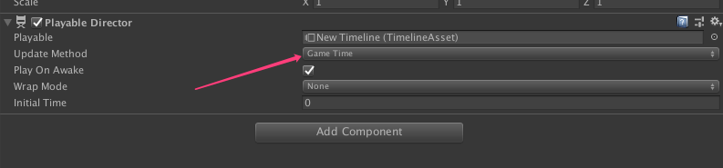
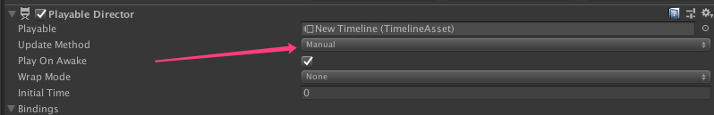

> 背景: 
> 
> 最近项目里重做了 PVE 战斗逻辑，用 Timeline 来配置技能的流程，战斗最高支持四倍速，直接通过 Timescale 来处理的（偷懒做法） 

> **问题:**
> 
> 最后实际在项目里发现在四倍速情况下会出现各种问题，
> 
> 经过仔细观察发现四倍速播放时有些 Timeline 里面的逻辑会丢失或执行不完全(比如移动控制，到不了终点)，
> 
> 经过 Debug 发现 策划配置的 Timeline 里有很多长度只有 `1帧` 的 Playable
> 所以在四倍速情况下，播放刷新频率不变，但是每次 Update 刷新时时间跨度变大了，所以某些片段会直接跳过
> 
> 所以那些时间长度只有`1帧`的 Playable 就很大概率被直接跳过，里面的 OnBehaviourPlay 和 OnProcessFrame 逻辑都不会执行
> 所以造成逻辑丢失，由于在最早使用 Timeline 时没仔细思考 Timeline 的执行逻辑，默认认为事件都会得到执行，其实仔细思考一些就会知道这里会出问题了，
> 一方面是太忙，进度催得紧，不过这都是借口，做事情之前还是要仔细思考
> 

> **解决办法:**
> 
> - 明确了问题之后这个问题就好解决了
> - 因为知道 Timeline 可以通过手动播放，我们的问题在于，游戏四倍速时，Timeline 默认通过 Update 刷新，刷新频率不变，时间跨度变大导致问题，
> 那么我们提高他的刷新频率就好了
> - 所以将 Timeline 的播放方式由 GameTime 改为 Manual 然后自己写脚本来刷新
> 
> 
> - 具体思路
>   - 我们一样用 Update 来刷新 `Timeline`，手动修改 `Timeline` 的时间就好，每次将 `Timeline` 的时间 都加上一个 `Time.deltaTime`
>   - 上面的逻辑其实实现了默认用 GameTime 刷新的效果，然后我们在将刷新频率提高就好
>   - 如下，我们在每帧刷新时，将`Time.deltaTime` 分成多份（根据 TimeScale 决定具体数值），
      这样我们在一帧刷新多次，就不会出现丢帧问题，且这只是改变了逻辑的刷新频率，渲染刷新还是跟帧率相关，所以并不会带来什么太高的额外性能消耗
```
            var timeScale    = Time.timeScale;
            var time         = Time.deltaTime;
            var timeInterval = 0f;
            
            // 这里之所以额外加2，是因为四倍速情况下还是有微弱的丢帧情况，应该是有误差，所以打了个补丁。。。
            // 为什么是加二呢，因为试了试加 2 刚刚好，哈哈哈哈，多了没意义，太少不行
            // 多刷新两次无非是计算频率提高了，不会带来渲染消耗，所以还好
            var updateRate = (int) timeScale + 2; 
            
            if (timeScale <= 1)
            {
                updateRate = 1;
            }
            
            for (var i = 0; i < updateRate; i++)
            {
                timeInterval += deltaTime / updateRate;

                if (i == updateRate - 1)
                    timeInterval = deltaTime;

                playableDirector.time = _timeClock + timeInterval;
                playableDirector.Evaluate ();
            }
            
            _timeClock += timeInterval;

```

> ❗️ 对啦！最后还有个小问题，就是用 Manual 方式播放 Timeline 时要将受控制的动画控制器的 `UpdateMode` 改为 AnimatePhysics，不然动画不播放，不知道为什么。。。没仔细研究，
> 这个问题也很坑，因为最初想用 Manual 方式播放时，只关注了其他逻辑是否得到执行，最后都写好后发现动画竟然不播放了。。。以为是不支持，最后发现改了 `UpdateMode` 就好了，
> 也没看到相关文档