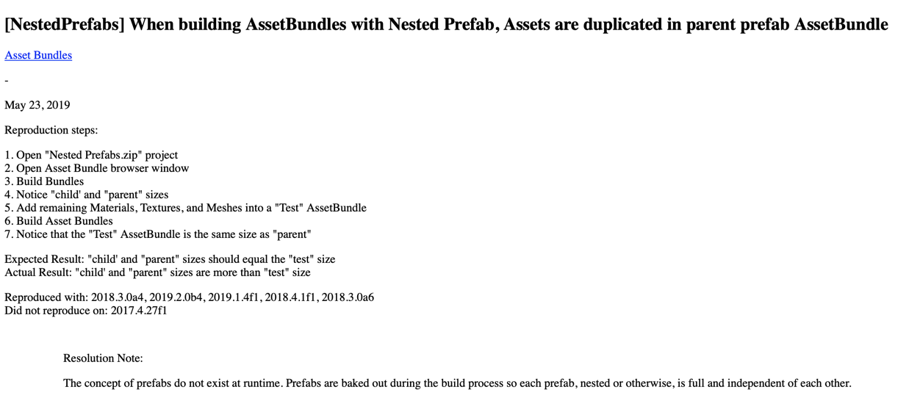
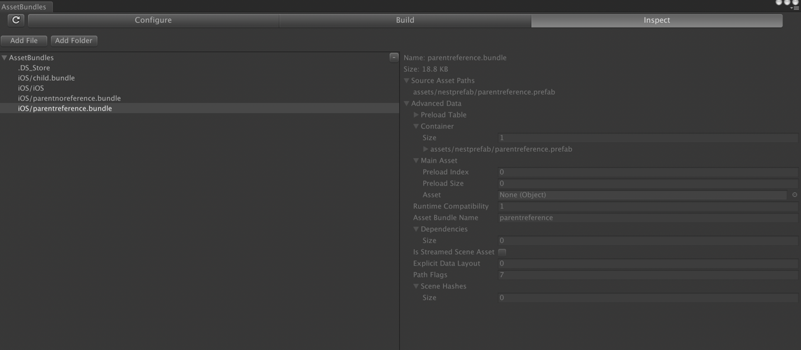
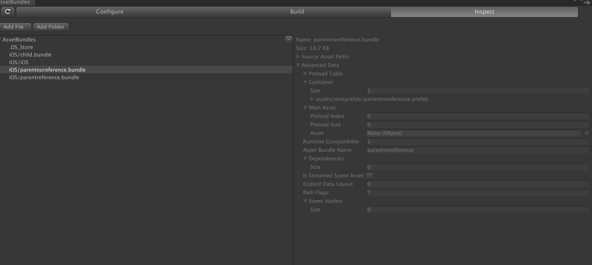
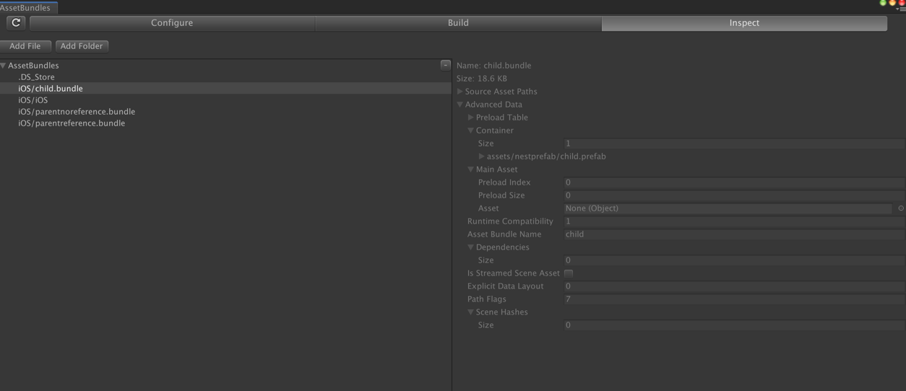
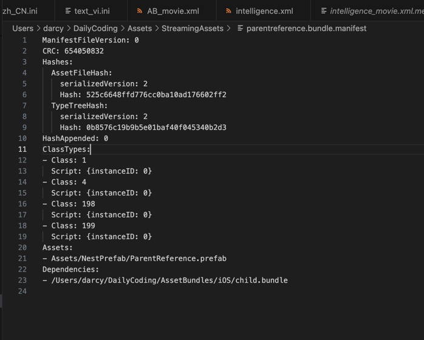

# Unity Prefab 嵌套的一些发现和理解

## 背景

近期项目里关于 prefab 嵌套中，prefab 的引用关系被去掉后有哪些副作用做了一些讨论，最后做了一些测试发现了一些跟预期不太一样的东西

## 关于功能及维护
首先功能及维护上来说，prefab 的引用关系在肯定是更好的，这个不做太多探讨

## 性能问题

### 现象
我们本来天真的认为，prefab 嵌套中，A 引用 B 时，切 A、B 分别设置了 Bundle，在打 Bundle 时，

A Bundle 内不会包含 B 的内容，只会保存一个引用关系，但是我们在测试后发现，这和我们预期的恰恰相反 A bundle 内包含了完整的 B（通过资源大小确认，并且 Inspect 后内容里面也是包含的），关于测试可以用 该文件夹内的三个 Prefab 打 Bundle 进行测试

### 探索
基于以上现象，查阅了很多资料，甚至怀疑我打 Bundle 的方式有问题，所以我同时测试了对于图片资源的引用，结果是对图片的引用是没问题的，被引用的图片不会 Copy 到 Bundle 中，而只是存在一个引用记录，说明我打 Bundle 的方式并没有问题

最后查到了一个别人提的 [Issue](https://issuetracker.unity3d.com/issues/nestedprefabs-when-building-assetbundles-with-nested-prefab-assets-are-duplicated-in-parent-prefab-assetbundle)

大致解释下就是他也发现了这个问题，并且认为这是一个 bug，但是他最终的 Resolution note 应该是他探索后得到的一个结论，刚好也解释了我的疑惑
大致意思是 Prefab 是没有运行时概念的，在打成 Bundle 时会被 Bake out，也就是以一个最终形态打在 Bundle 内，不借助引用关系（这里还有一点细节，稍后介绍）
我认为他的这个解释应该是正确的，测试结果也刚好反映了这一点，如果大家知道其他信息欢迎给我提 issue ...

但是这有一点值得说一下，虽然 Bundle 内没有体现这种引用关系，但是在 Manifest 中，这种引用关系是存在的，我认为这是因为虽然 Prefab 在最终 Bundle 不需要依赖被引用的 Prefab，但是一个 Prefab 可能引用了其他资源，或许是图片
或许是 shader 等等，所以这种引用关系还是需要体现的，只有当这个 prefab 没有引用任何其他资源时，这个引用关系才没有意义，所以 Unity 在 Manifest 文件中为我们保留了这个引用关系的记录

以下是 Unity 内 Bundle 测试的一些截图，打出的 Bundle 在 SteamingAssets 内

### 结论
我们最初做这个探索是因为想要测试 prefab 破除引用关系后对性能有多大影响，是否会多占用内存，基于以上的测试和探索，可以得到的结论是，prefab 解除引用后不会增加内存，因为 bundle 的实际大小是一样的
那么最终加载到内存里面的东西大小也就是一样的，反而这里有一点值得注意的，解除引用的 Prefab 打的 Bundle 由于没有依赖另外的 Bundle，并不会额外加载一个 Bundle，而未解除引用关系的 Prefab 打的 Bundle，还引用着另外一个 Bundle
这是我们的 Bundle 加载逻辑，所以基于此点，未解除引用的反而内存占用会多一点（只看这两个 Bundle 的情况下），从这点来说，我觉得 unity 这里存在漏洞，不知道后续版本有没有优化

