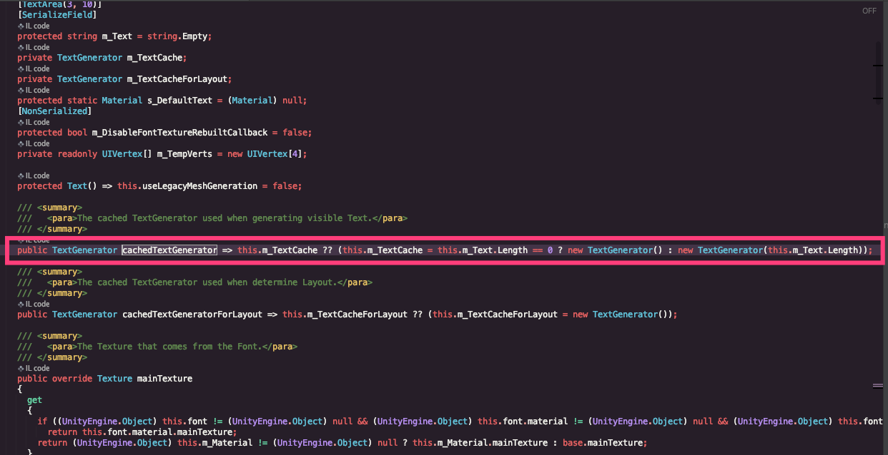
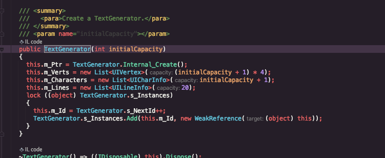

# UGUI Text

> Text 在 第一次 OnEnable 时 会调用字体生成器 TextGenerator 这个生成器第一次调用时会进行初始化， 若当前 text 文本为空，则默认按五十个文字长度来初始化生成器， 会造成较多的 GC 若文本内容不为空，则按当前文本内容长度来初始化

## 总结

> 1. 界面在制作时 Text 提前赋值（长度与实际运行期动态赋值的文本相似），则会减少 GC
> 2. 不一定显示的 Text 默认关闭 也会减少 GC
> 3. 一般情况可能没必要在一这点 GC 但是在页面 Text 数量非常多时，影响就比较大了

